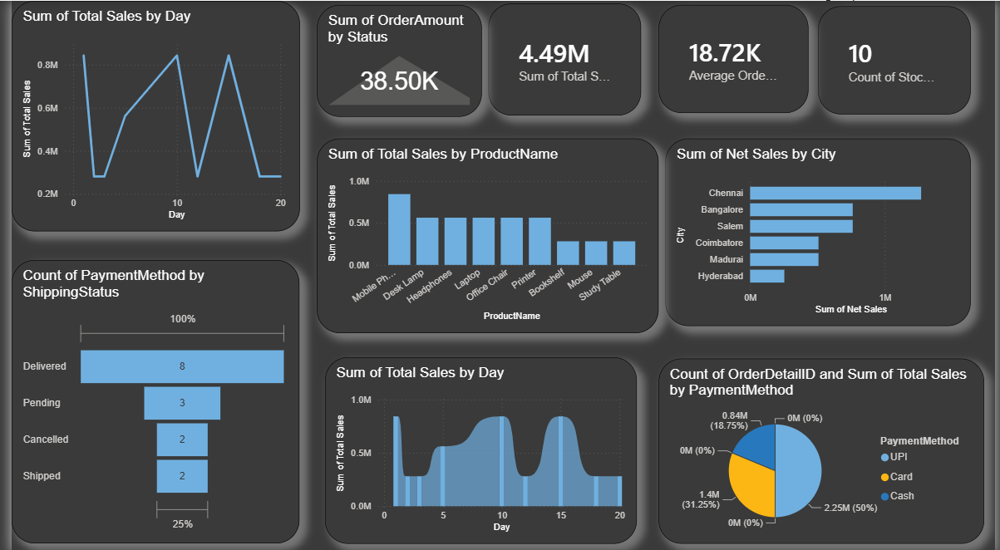

📈 Sales Analytics Power BI Dashboard

A Power BI dashboard created to understand sales and order data in a simple and interactive way.

The dashboard brings different parts of the sales data together, including orders, products, cities, payment methods, shipping status, and daily sales. The aim is to turn the raw sales database into useful information that can be understood quickly through visualizations.

## Dashboard Preview

<p align="center">
  
</p>

## About the Project

This project was created using SQL Server and Power BI. The sales data was connected to Power BI, cleaned and transformed using Power Query, and then analyzed using DAX.

The dashboard provides an overview of sales performance and helps identify patterns in products, cities, orders, payments, and shipping.

## Dashboard Highlights

* Daily sales analysis
* Total sales and average order value
* Product-wise sales comparison
* City-wise sales performance
* Order and shipping status analysis
* Payment method distribution
* Stock information
* Interactive Power BI visualizations

##🛠️Technologies Used

* Power BI
* SQL Server
* DAX
* Power Query
* GitHub

##🔍Key Areas Analyzed

### 🧮Sales Performance

The dashboard shows overall sales and daily sales trends to understand how sales change over time.

### Product Analysis

Product-wise sales are compared to identify products contributing more to overall revenue.

### City-wise Analysis

Sales performance is visualized across different cities to understand which locations contribute the most.

### Order & Shipping Analysis

Order and shipping statuses such as Delivered, Pending, Cancelled, and Shipped are analyzed to understand the current order situation.

### Payment Analysis

Different payment methods are compared to understand how customers are making payments.

## DAX & Data Analysis

DAX measures were used to calculate important business metrics such as total sales, average order value, order counts, and other dashboard KPIs.

## What I Learned

Through this project, I got practical experience in connecting SQL Server with Power BI, working with sales data, creating DAX measures, designing visualizations, and presenting business information through an interactive dashboard.

## Project Structure

```text
Sales-Analytics-PowerBI-Dashboard/
│
├── SalesDashboard.pbip
├── SalesDashboard.Report/
├── SalesDashboard.SemanticModel/
├── SalesDB.sql
├── Dashboard.png
└── README.md
```

## Future Improvements

* Add monthly and yearly sales comparisons
* Add customer-level analysis
* Add profit and margin analysis
* Add sales forecasting
* Add interactive drill-through pages
* Add more detailed product and regional analysis

## Author

**Yuvasri R**

B.Tech Information Technology
St. Joseph's College of Engineering
